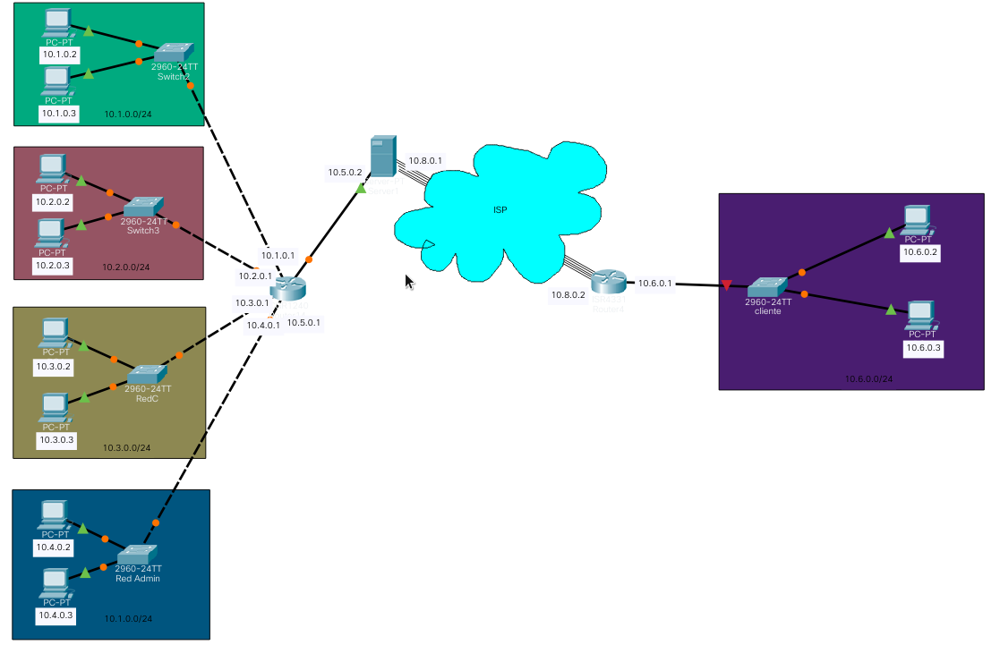

# ProyectoFinalRedes1
Administracion de Redes - Conexion Cliente y Servidor por medio de OpenVpn

Conexion de 5 redes distintas a traves de un Router, Server y Cliente Vpn con la herramienta OpenVpn

 
